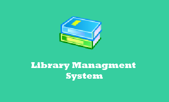
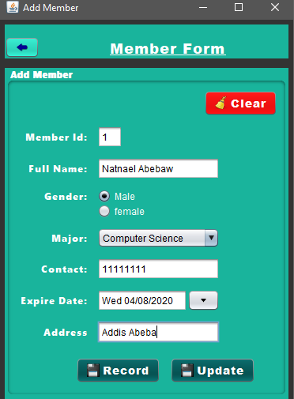
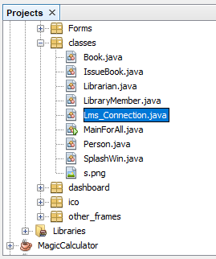

# Library-Management-System V1.0
**Library management system is a simple and totally complete book library system.**

## Project Inspiration: 
The College Where i'm Learning Right Now is an ICT focused private higher-learning institution in
Ethiopia. the college uses a manual or traditional system to manage the college’s library, most of
the thing such as; record of books, number of books in the library, record of members of the
library, record of members who have issued books, etc… are recorded using pen-paper system.
this kind of system requires lots of time and man power for performing simple operations in the
library. CLMS is a software application useful for librarians for management and handling of
typical task in the library.

## Drawbacks of existing system:
* record keeping is paper-based.
* there is high risk of data mis-management.
* librarian and students face a lot of problem while searching a book.
* the existing system is not efficient.

## proposed system:
the proposed system is developed after the analysis of drawbacks of the existing system.
using this software, a librarian can store information of all the books, with book title, author,
etc… available in the library, all the books available in the library can be displayed in a list so
that students need not roam through the entire library to find a book. moreover, the software
effectively maintains the details of members of the library to whom books have been issued and
also records of issued date and return date.

## User of The System
### Librarian
1. Can Add, Update, View and Delete Books.
2. Can Add, Update, View and Delete Library Members. 
3. Can Issue Book for Library Members.

## FrontEnd And BackEnd
* **Frontend** - Java - Swing
* **backend** - MySQL 

## Tools Used
1. Use any IDE to develop the project. It may be Eclipse /Myeclipse / Netbeans etc... Ipersonally Used Netbeans for this Project.
2. MySQL for the database (MySQL Workbench 8.0 CE).

# Get Started...
1. Import the SQL Database File to the Workbench.
2. Import the the Project to Netbeans or any Java Ide You Would Like to Work on.
3. Create a connection Between the Project and the Database.
- to establish a connection open the highlighted file in the Picture. 

## for Any Suggestions or Issues DM Me.
### Email: <natiabebaw35@gmail.com>
### LinkedIn: [https://www.linkedin.com/in/natnael-abebaw/](https://www.linkedin.com/in/natnael-abebaw/)
